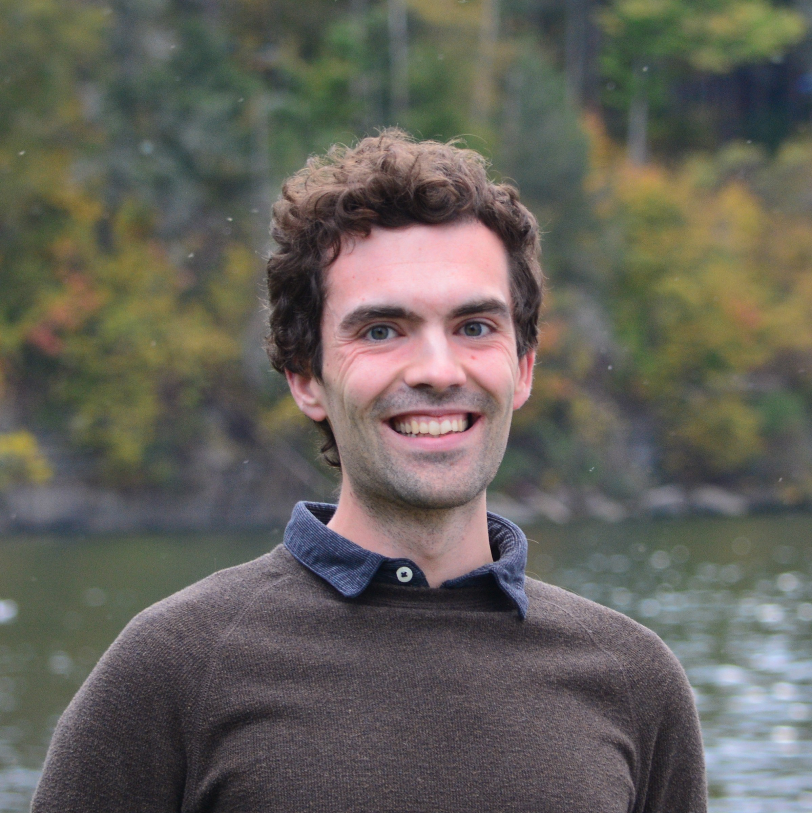

---
# Feel free to add content and custom Front Matter to this file.
# To modify the layout, see https://jekyllrb.com/docs/themes/#overriding-theme-defaults

layout: default
---


I'm a Ph.D. candidate in mathematics at [Cornell University](https://math.cornell.edu), advised by [Inna Zakharevich](https://pi.math.cornell.edu/~zakh). I will be on the postdoctoral job market in the fall of 2025.

I'm an algebraic topologist, focusing on algebraic K-theory and equivariant stable homotopy theory. I've recently taken an interest in connections to modular representation theory.

<!-- __equivariant algebra__: the study of [Mackey functors](https://en.wikipedia.org/wiki/Mackey_functor) equivariant stable homotopy theory -->

[__CV__](assets/pdf/cv-cv-2025-10-15.pdf) (Last updated: October 15, 2025)

I pronounce my last name as "VOH-guh-lee" in English, but it's really [Swiss German](https://en.wiktionary.org/wiki/V%C3%B6geli) in origin.

<!-- __Some things I'm involved in:__
- I organize the <a href="https://sites.google.com/cornell.edu/cornell-drp">Cornell Directed Reading Program</a> along with [Alekos Robotis](https://aarobotis.github.io/). -->

<!-- - I organize [HoMoToPIESS](homotopy) along with [Kimball Strong](https://e.math.cornell.edu/people/Kimball_Strong/). -->

---

## Events
- October 2025: [AMS Fall Central Sectional Meeting](https://www.ams.org/meetings/sectional/2322_program_ss12.html), St. Louis, MO
- January 2026: Joint Mathematics Meetings, Washington, DC 

<!-- ### Past Events -->
<!-- - June 2025: [Macaulay2 Workshop](https://macaulay2.github.io/Workshop-2025-Madison/), Madison, WI -->
<!-- - June 2025: Talbot Workshop, Cassopolis, MI -->
<!-- - May 2025: [New horizons for equivariance in homotopy theory](https://www.newton.ac.uk/event/ehtw03/), Cambridge, UK -->
<!-- - May 2025: [Cornell Topology Festival](https://e.math.cornell.edu/sites/topology/2025/index_2025.php), Ithaca, NY -->
<!-- - April 2025: University of Pennsylvania Geometry-Topology Seminar, Philadelphia, PA -->
<!-- - April 2025: University at Albany Algebra/Topology Seminar, Albany, NY -->
<!-- - March 2025: University of Virginia Topology Seminar, Charlottesville, VA -->
<!-- - March 2025: [Upstate New York Topology Seminar](https://sites.google.com/view/unytsbinghamton/home), Binghamton, NY -->
<!-- - December 2024: [Hot Topics: Life after the Telescope Conjecture](https://www.slmath.org/workshops/1103), Berkeley, CA -->
<!-- - October 2024: [AMS Fall Eastern Sectional Meeting](https://www.ams.org/meetings/sectional/2317_program_ss10.html), Albany, NY -->
<!-- - September 2024: [Binghamton University Topology and Geometry Seminar](https://www2.math.binghamton.edu/p/seminars/topsem), Binghamton, NY -->
<!-- - May 2024: [Cornell Topology Festival](https://e.math.cornell.edu/sites/topology/2024/index_2024.php), Ithaca, NY -->
<!-- - April 2024: [Graduate Student Topology and Geometry Conference](https://sites.google.com/view/gstgc2024msu/), East Lansing, MI
- January 2024: [Joint Mathematics Meetings](https://www.jointmathematicsmeetings.org/meetings/national/jmm2024/2300_program_ss47.html), San Francisco, CA -->
<!-- - November 2023: [BUGCAT](https://seminars.math.binghamton.edu/BUGCAT/index.html), Binghamton, NY -->
<!-- - September 2023: [Algebraic K-Theory and Redshift](https://redshift.mathi.uni-heidelberg.de/), Mainz, DE -->
<!-- - June 26-30, 2023: [Scissors Congruence, Algebraic K-theory, and Trace Methods](https://topology.math.indiana.edu/Summer2023/main.php), Bloomington, IN -->
<!-- - May 5-7, 2023: [Cornell Topology Festival](https://e.math.cornell.edu/sites/topology/2023/index_2023.php), Ithaca, NY -->
<!-- - April 15-16, 2023: [Mid-Atlantic Topology Conference](https://sites.google.com/view/mid-atlantic-topology/home), Philadelphia, PA -->
<!-- - November 5-6, 2022: [BUGCAT](https://seminars.math.binghamton.edu/BUGCAT/index.html), Binghamton, NY -->
<!-- - September 26-30, 2022: [European Autumn School in Topology](https://www.math.ru.nl/~sagave/east2022/), Utrecht, NL -->
<!-- - August 8-11, 2022: [Communicating Mathematics](https://sites.google.com/view/communicating-math/), Ithaca, NY -->
<!-- - June 27-30, 2022: [Homotopy Theory with Applications to Arithmetic and Geometry](http://www.fields.utoronto.ca/activities/21-22/homotopy), Toronto, ON -->
<!-- - May 6-8, 2022: [Cornell Topology Festival](https://e.math.cornell.edu/sites/topology/2022/index_2022.php), Ithaca, NY -->

---

## Research

### Publications

__The Galois-equivariant $$K$$-theory of finite fields__  
with [David Chan](https://sites.google.com/view/davidchanmath). *Proceedings of the London Mathematical Society* (2025).  
[[arXiv:2406.19481](https://arxiv.org/abs/2406.19481)] [[doi:10.1112/plms.70012](https://doi.org/10.1112/plms.70012)]

### Preprints

__$$C_p$$-Mackey functors in Macaulay2__  
with [Thomas Brazelton](https://tbrazel.github.io/), [David Chan](https://sites.google.com/view/davidchanmath), [Benjamin Mudrak](https://benjaminmudrak.github.io/), [Ben Spitz](https://benspitz.com/), [Chenglu Wang](https://chengluw.github.io/), [Michael Zeng](https://sites.google.com/uw.edu/zengrf/), and [Sasha Zotine](https://sites.google.com/view/szotine/home). Submitted.  
[[arXiv:2509.05456](https://arxiv.org/abs/2509.05456)]

__Bredon homological stability for configuration spaces of $$G$$-manifolds__  
with [Eva Belmont](https://sites.google.com/case.edu/ebelmont) and [J.D. Quigley](https://quigleyjd.github.io/). Submitted.  
[[arXiv:2311.02459](https://arxiv.org/abs/2311.02459)]

__Uniformly vertex-transitive graphs__  
with Simon Schmidt and [Moritz Weber](https://www.uni-saarland.de/lehrstuhl/weber-moritz.html).  
[[arXiv:1912.00060](https://arxiv.org/abs/1912.00060)]

### Software

[```CpMackeyFunctors```](): a [Macaulay2](https://macaulay2.com/) package for homological algebra with $$C_p$$-Mackey functors (to be included with a future release)

### Expository & Other Writing

<!-- [__The Homotopy Theory of Orthogonal Spectra__]() (in preparation)  
A writeup I prepared for my Admission to Candidacy Exam (A Exam) in November 2022. -->

[__English Translation of tom Dieck's *Faserb&uuml;ndel mit Gruppenoperation*__](assets/pdf/dieck-buendel.pdf)  
Translation to fulfil the language requirement of the Cornell mathematics graduate program.

<!-- [__5/8 and Isoclinism__]() (in preparation)  
Notes on the commuting probability of a finite group and the connection to isoclinism. Prepared for a talk given at the [Olivetti Club](https://pi.math.cornell.edu/m/node/10767) in September 2021. -->

<!-- [__Counting Symmetries with Group Actions__](assets/pdf/group-actions.pdf)  
Notes from a class aimed at high school students taught at [Splash](https://esp.mit.edu/learn/index.html) in November 2019. -->

<!-- --- -->

<!-- ## Undergraduate research -->

<!-- In the summer of 2019, I worked on research in computational aspects of quantum groups at [Universit&auml;t des Saarlandes](https://www.uni-saarland.de/en/department/mathematics.html) in the research group of [Moritz Weber](https://www.math.uni-sb.de/ag/speicher/weberE.html), supported by a DAAD RISE scholarship and by the DFG research center [SFB-TRR 195](https://www.computeralgebra.de/sfb/). -->

<!-- In the summer of 2018, I worked on research in algebraic graph theory at [Imperial College London](https://www.imperial.ac.uk/mathematics) under [Joanna Fawcett](http://www.jfawcett.com/) as a part of the MIT-Imperial Research Exchange.		 -->

---

#### __A puzzle: what comes next in the sequence?__  
2, 3, 5, 7, 11, 13, 17, 19, 23, 29, 31, 37, 41, 43, 47, 53, 59, 60, 61, 67, 71, 73, 79, 83, 89, 97, 101, 103, 107, 109, 113, 127, 131, 137, 139, 149, 151, 157, 163, 167, [???](https://oeis.org/A005180)

---

*Das Sph&auml;renspektrum hat der liebe Gott gemacht, alles andere ist Menschenwerk.*
